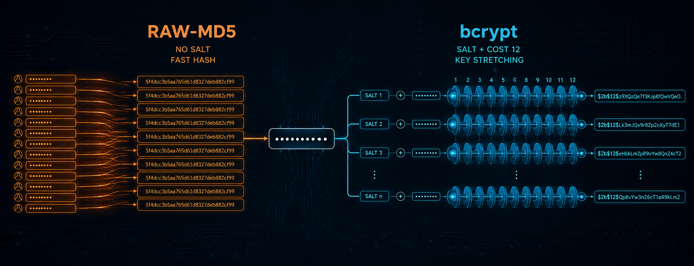

<p align="center">
  
</p>

# Analisi sperimentale della sicurezza delle password in uno scenario di attacco offline

## Presentazione del progetto

Questo repository contiene l’analisi integrale sviluppata per l’elaborato del corso di **Principi e Metodi di Crittografia**. Il progetto studia, in un ambiente controllato, quanto la funzione di hash utilizzata per proteggere una password influenzi la velocità con cui un attaccante può verificarne le possibili candidate dopo aver ottenuto una copia degli hash.

L’esperimento confronta **Raw-MD5**, funzione veloce e priva di salt, con **bcrypt**, configurato con salt casuale e costo 12. La stessa password sintetica viene trasformata con entrambi i metodi e sottoposta a un attacco offline mediante **John the Ripper**, utilizzando la medesima wordlist di 20.000 candidate.

La relazione accademica costituisce una sintesi dei passaggi e dei risultati principali. Il Jupyter Notebook presente in questo repository documenta invece l’intera analisi sperimentale, includendo configurazione dell’ambiente, generazione controllata dei dati, esecuzione degli attacchi, validazione dei risultati, misurazioni, tabelle, grafici e prove supplementari su CPU e GPU.

## Obiettivo dell’analisi

Lo scopo non è valutare la robustezza della singola password, ma isolare l’effetto della funzione di hash mantenendo invariate tutte le altre condizioni sperimentali. Per questo motivo Raw-MD5 e bcrypt vengono confrontati usando la stessa password, la stessa wordlist, la stessa posizione della soluzione e il medesimo strumento di verifica.

L’esperimento consente di osservare concretamente la differenza tra una funzione progettata per essere molto veloce e una funzione specificamente concepita per la protezione delle password. Il salt non rende impossibile indovinare una password presente nella wordlist, ma impedisce di riutilizzare lo stesso calcolo tra hash protetti da salt differenti e rende inutilizzabili le rainbow table universali. Il costo di bcrypt, invece, aumenta deliberatamente il lavoro necessario per ogni singolo tentativo.

## Scenario sperimentale

| Elemento                    | Configurazione                                       |
| --------------------------- | ---------------------------------------------------- |
| Scenario                    | Attacco offline controllato                          |
| Password                    | Sintetica, lunga 17 caratteri                        |
| Composizione                | Maiuscole, minuscole, cifre e simboli                |
| Wordlist                    | 20.000 candidate uniche                              |
| Posizione della soluzione   | Ultima riga                                          |
| Primo formato               | Raw-MD5 senza salt                                   |
| Secondo formato             | bcrypt con salt casuale e costo 12                   |
| Strumento                   | John the Ripper Jumbo                                |
| Ambiente                    | Python 3.10 e Jupyter Notebook                       |
| Accelerazione supplementare | NVIDIA GeForce RTX 5070 Ti Laptop GPU tramite OpenCL |

La collocazione della password all’ultima posizione obbliga John the Ripper a esaminare l’intera wordlist prima di trovare la soluzione. In questo modo entrambi i formati vengono sottoposti allo stesso numero di candidate e il confronto non dipende dalla posizione casuale della password.

La prova utilizza un **attacco a dizionario basato su wordlist** e non una ricerca esaustiva di tutte le combinazioni possibili. La wordlist è stata generata esclusivamente per il laboratorio e contiene soltanto dati sintetici.

## Generazione degli hash

La password viene codificata in UTF-8 e trasformata nei due formati previsti dall’esperimento:

```python
# Converte la password sintetica in byte.
password_bytes = PASSWORD.encode("utf-8")

# Raw-MD5 produce un'impronta deterministica senza salt.
md5_hash = hashlib.md5(password_bytes).hexdigest()

# bcrypt genera un salt casuale e incorpora il costo 12.
bcrypt_salt = bcrypt.gensalt(rounds=12)
bcrypt_hash = bcrypt.hashpw(
    password_bytes,
    bcrypt_salt,
).decode("utf-8")
```

Raw-MD5 produce sempre la stessa impronta quando riceve la medesima password. bcrypt genera invece stringhe differenti grazie all’impiego di salt casuali, anche quando password e costo rimangono invariati.

Due stringhe bcrypt generate dalla stessa password, con salt casuali distinti e costo 12, sono infatti risultate diverse. Per facilitarne il confronto senza riportarle integralmente, nel notebook sono mostrate le rispettive impronte SHA-256 abbreviate:

```text
2df99491de099800
baa72fb02ca5a306
```

Entrambe le stringhe superano comunque la verifica con la password originale. La differenza osservata dipende quindi dal salt e non da una modifica della password.

## Esecuzione con John the Ripper

John the Ripper viene avviato separatamente sui due file di hash, mantenendo invariata la wordlist. File `.pot` distinti impediscono che il risultato di una prova precedente venga riutilizzato nelle esecuzioni successive.

La validazione non si basa soltanto sul codice di uscita del processo. Il notebook controlla anche l’output di `--show`, la presenza della password recuperata e il numero di hash ancora da individuare.

Esempio generale dei comandi utilizzati:

```powershell
john.exe --format=Raw-MD5 --wordlist=wordlists/wordlist_20000.txt hashes/hash_md5.txt

john.exe --format=bcrypt --wordlist=wordlists/wordlist_20000.txt hashes/hash_bcrypt.txt
```

Nel notebook i percorsi, i file `.pot`, la pulizia delle sessioni e la raccolta dei risultati sono gestiti automaticamente da Python.

## Risultati principali

Entrambe le password sono state recuperate perché la candidata corretta era presente nella wordlist. La differenza sostanziale riguarda il numero di tentativi verificabili nell’unità di tempo.

| Formato | Salt |           Costo | Candidate effettive al secondo | Esito      |
| ------- | ---: | --------------: | -----------------------------: | ---------- |
| Raw-MD5 |   No | Non applicabile |                       82.440,2 | Recuperata |
| bcrypt  |   Sì |              12 |                          324,6 | Recuperata |

Nella prova end-to-end Raw-MD5 ha verificato le candidate con una velocità effettiva circa **254 volte superiore** a bcrypt. Questo risultato non significa che bcrypt renda impossibile l’indovinamento di una password debole o già presente in un dizionario. Mostra invece che il costo computazionale imposto a ogni tentativo modifica in modo decisivo la quantità di candidate analizzabili nello stesso intervallo di tempo.

I valori ottenuti descrivono la specifica configurazione hardware e software utilizzata nel laboratorio. Non devono essere interpretati come prestazioni universali, perché tempi e throughput possono cambiare in funzione del processore, del numero di thread, della versione di John the Ripper, dei backend disponibili e delle condizioni della singola esecuzione.

## Studio del costo di bcrypt

Il notebook comprende una sezione dedicata al comportamento del parametro di costo di bcrypt. Il valore di costo controlla il numero di iterazioni della funzione e segue una progressione esponenziale: un incremento unitario raddoppia approssimativamente il lavoro richiesto.

Lo studio permette di confrontare i costi 8, 10, 12 e 14 e di osservare la crescita del tempo necessario per calcolare una singola stringa bcrypt. Questa parte dell’analisi è distinta dall’attacco principale, che utilizza esclusivamente bcrypt con costo 12.

Il costo deve essere scelto cercando un equilibrio tra sicurezza e usabilità. Un valore più elevato rallenta gli attacchi offline, ma aumenta anche il tempo e le risorse richiesti al sistema legittimo durante autenticazione e registrazione.

## Prova supplementare sulla GPU

Il repository documenta anche una prova separata sulla **NVIDIA GeForce RTX 5070 Ti Laptop GPU**, eseguita tramite il backend OpenCL di John the Ripper. Questa sezione serve a osservare la capacità di parallelizzazione dell’architettura GPU sui formati adatti a un numero molto elevato di operazioni indipendenti.

Il benchmark Raw-MD5 mostra l’elevato throughput raggiungibile dalla GPU in un carico sufficientemente esteso. L’attacco con una wordlist di sole 20.000 candidate è però troppo breve per sfruttare pienamente tale capacità: inizializzazione di OpenCL, preparazione del kernel, allocazione dei buffer, trasferimento dei dati e sincronizzazione finale possono incidere più del calcolo vero e proprio.

Per questo motivo i risultati del benchmark e quelli dell’attacco end-to-end vengono mantenuti separati. Un throughput teorico molto elevato non implica automaticamente un vantaggio proporzionale in ogni prova reale, soprattutto quando il carico è ridotto.

Anche il benchmark bcrypt viene interpretato separatamente dall’attacco principale quando utilizza un costo diverso. I risultati ottenuti con un determinato costo non vengono trasferiti direttamente a bcrypt con costo 12.

## Struttura del repository

```text
Password_Offline_Lab/
│
├── Password_Offline_Lab_GPU_RTX5070Ti_CHECK_FINALE.ipynb
├── README.md
├── requirements.txt
│
├── data/
│   └── dati e configurazioni del laboratorio
│
├── hashes/
│   ├── hash_md5.txt
│   └── hash_bcrypt.txt
│
├── wordlists/
│   └── wordlist_20000.txt
│
├── outputs/
│   └── output e file di sessione di John the Ripper
│
├── results/
│   └── risultati strutturati delle misurazioni
│
├── figures/
│   └── grafici generati dal notebook
│
├── report/
│   └── relazione sintetica dell’elaborato
│
└── JtR/
    └── ambiente locale di John the Ripper
```

Il notebook rappresenta il nucleo del progetto. Le cartelle separano dati di ingresso, hash, wordlist, output grezzi, risultati elaborati e figure, così da rendere più semplice controllare e riprodurre ogni fase dell’esperimento.

## Dashboard di esecuzione

All’inizio del notebook è presente una dashboard centralizzata che permette di scegliere quali sezioni eseguire. I flag controllano lo studio del costo di bcrypt, i benchmark CPU, la prova di scalabilità, il benchmark GPU e gli attacchi GPU opzionali.

Le celle successive leggono queste impostazioni senza ridefinirle. In questo modo l’intera esecuzione può essere configurata da un unico punto, evitando modifiche sparse nel notebook.

## Requisiti

L’analisi è stata sviluppata con Python 3.10, Jupyter Notebook e John the Ripper Jumbo. Le principali dipendenze Python comprendono `bcrypt`, `pandas`, `numpy`, `matplotlib`, `psutil` e gli strumenti utilizzati per la presentazione degli output.

Le dipendenze possono essere installate con:

```powershell
python -m pip install -r requirements.txt
```

Per creare un ambiente virtuale su Windows:

```powershell
python -m venv .venv
.\.venv\Scripts\Activate.ps1
python -m pip install --upgrade pip
python -m pip install -r requirements.txt
```

Dopo aver configurato il percorso dell’eseguibile di John the Ripper nella dashboard iniziale, il notebook può essere aperto con:

```powershell
jupyter notebook
```

oppure:

```powershell
jupyter lab
```

Le sezioni GPU richiedono una versione di John the Ripper con supporto OpenCL, driver compatibili e un dispositivo correttamente rilevato. Se questi requisiti non sono disponibili, le prove GPU possono essere disattivate dalla dashboard senza compromettere l’analisi principale su CPU.

## Riproducibilità e limiti

Riproducibilità e limiti

Il progetto è stato costruito per rendere esplicite le condizioni sperimentali. La password, gli hash, la wordlist e gli altri file di laboratorio sono generati e utilizzati localmente. Le misurazioni vengono registrate insieme alla configurazione della sessione, mentre tabelle e grafici derivano direttamente dai risultati raccolti dal notebook.

L’esperimento principale su CPU può essere riprodotto anche su sistemi dotati di una GPU diversa o privi di accelerazione OpenCL. Le prove supplementari su GPU richiedono invece un dispositivo compatibile con OpenCL, correttamente riconosciuto da John the Ripper Jumbo. L’indice del dispositivo deve essere adattato alla configurazione del sistema utilizzato oppure selezionato automaticamente dal notebook.

La procedura sperimentale rimane riproducibile su hardware differente, ma non è possibile attendersi gli stessi tempi e valori di throughput. Le prestazioni dipendono infatti dal processore, dal modello di GPU, dai driver, dal backend OpenCL, dalla versione del software e dalle condizioni della singola esecuzione.

La prova non rappresenta un attacco contro sistemi reali e non utilizza credenziali appartenenti a terzi. I risultati non devono essere generalizzati senza considerare l’hardware, il software, la dimensione della wordlist e i parametri degli algoritmi.

L’analisi non dimostra che una password lunga e casuale possa essere individuata mediante ricerca esaustiva in tempi realistici. Dimostra invece che, quando la password candidata è già presente nella wordlist, la funzione impiegata per proteggerla determina il costo di ogni verifica e, di conseguenza, la sostenibilità complessiva dell’attacco offline.

## Considerazioni conclusive

Il confronto mette in evidenza il limite fondamentale delle funzioni di hash veloci quando vengono utilizzate direttamente per memorizzare password. Raw-MD5 consente di calcolare un numero molto elevato di tentativi e non offre una protezione individuale tramite salt.

bcrypt affronta il problema introducendo salt casuale e key stretching. Il salt impedisce la precomputazione generalizzata e il riutilizzo diretto del lavoro tra hash differenti, mentre il costo rallenta deliberatamente ogni tentativo. La sicurezza complessiva dipende comunque anche dalla qualità della password, dalla corretta configurazione del sistema, dalla protezione del database e dall’impiego di ulteriori misure, come l’autenticazione multifattore.

## Uso responsabile

Il repository è stato realizzato esclusivamente per finalità didattiche e sperimentali. Tutte le password, le wordlist e gli hash impiegati sono sintetici e generati localmente. Gli strumenti e le procedure documentati devono essere utilizzati soltanto su dati propri o in ambienti per i quali si dispone di un’autorizzazione esplicita.
